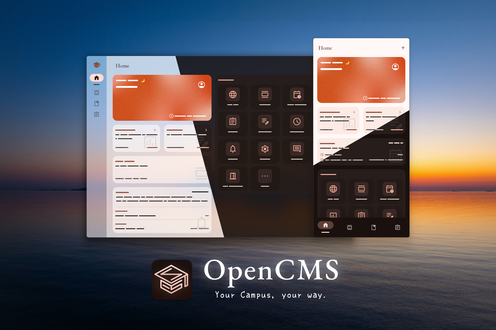
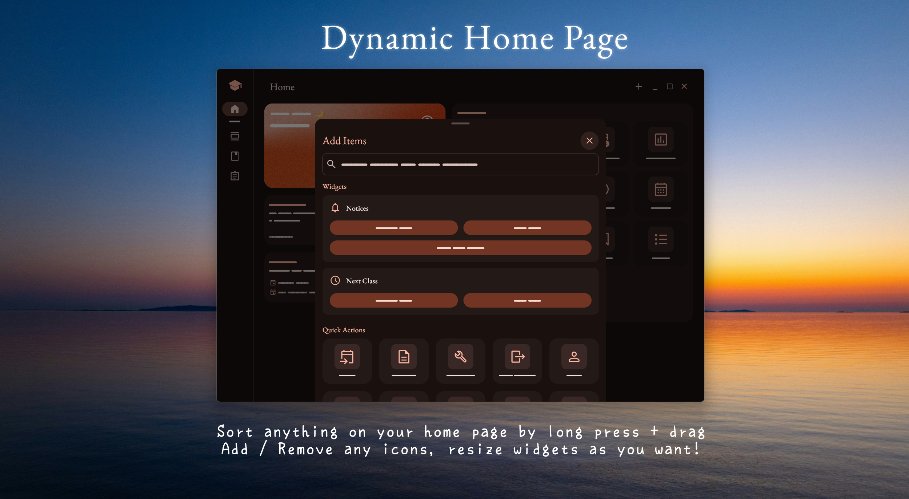
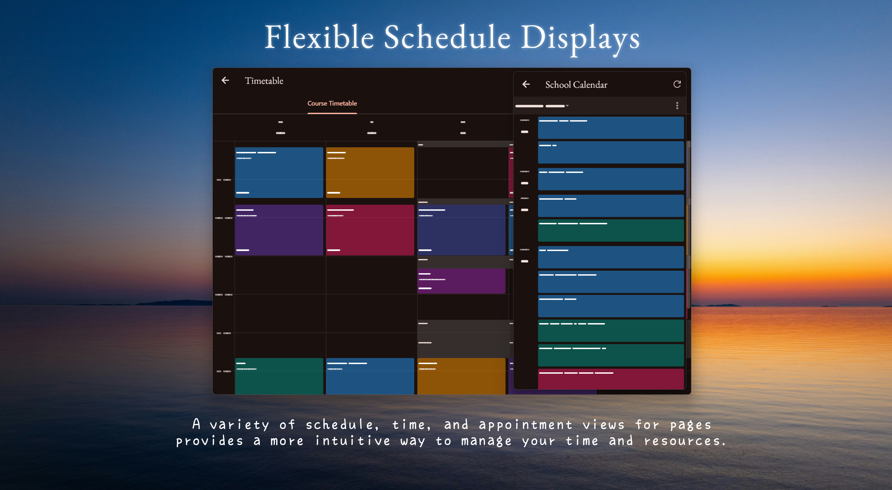
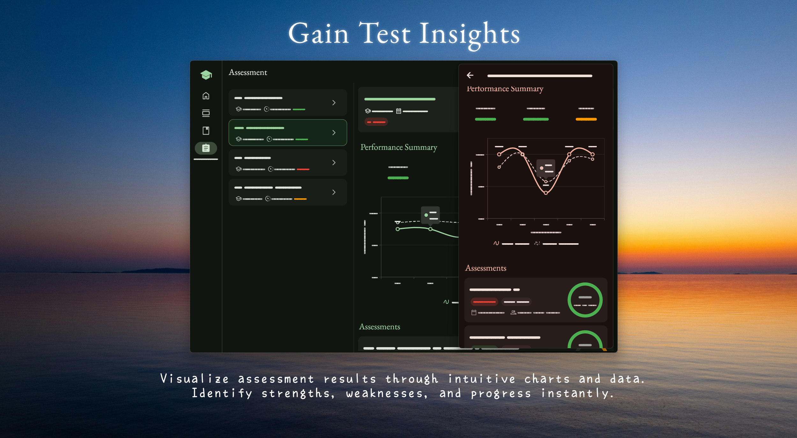
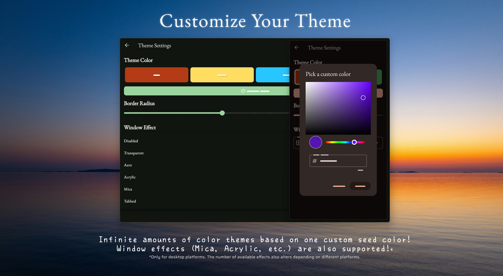
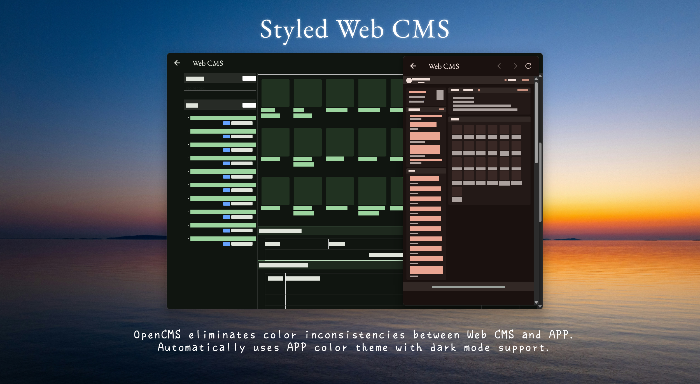
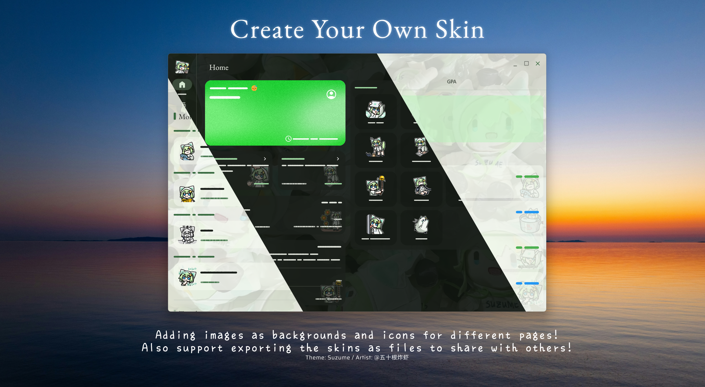
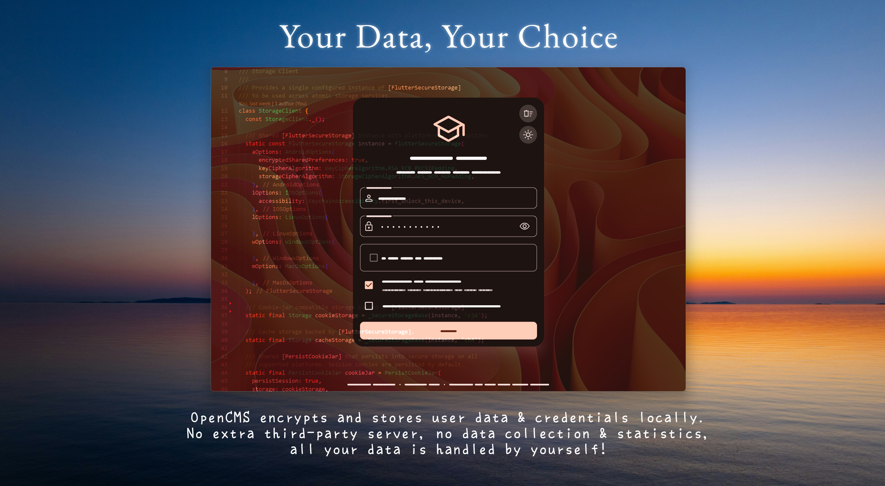
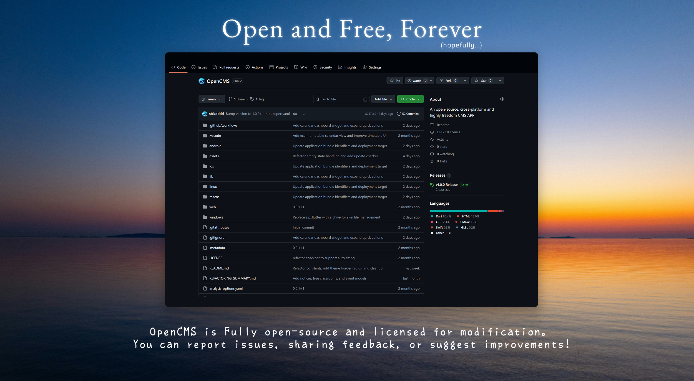

# OpenCMS

## ⚠️ Important Notices

### **macOS and iOS Users**: Please note that the app may not work optimally on macOS and iOS platforms as I don't have a proper testing environment for these platforms. If you encounter any issues, please submit a bug report.

### **Distribution Notice**: Due to related school regulations and open-source considerations, this app will **not** be published to **any app stores** **in any form**.

---

An open-source, cross-platform campus management app designed for students at a specific school.

<details>
<summary>Features</summary>












</details>

## 🚀 Getting Started

### System Requirements
- **Android**: Android 5.0 (API level 21) or higher
- **iOS**: iOS 11.0 or higher
- **Windows**: Windows 10 version 1903 or higher (64-bit only)
- **macOS**: macOS 10.14 or higher

### Download and Install

1. **Check your system architecture**:
   - **Windows**: 64-bit only (Flutter requirement)
   - **macOS**: Intel or Apple Silicon (M1/M2) - check in About This Mac
   - **iOS**: iOS 11.0 or higher (Flutter requirement)
   - **Android**: Check in Settings > About Phone for architecture (arm64, x86_64, or armeabi-v7a)

2. **Download the latest release**:
   - Visit the [Releases](https://github.com/your-username/OpenCMS/releases) page
   - Download the appropriate version for your platform and architecture
   - Follow the platform-specific installation instructions below

3. **Install and run**:
   - **Android**: Install the APK file and grant necessary permissions
   - **iOS**: Sign the app archive and sideload the IPA file (requires Apple Developer account)
   - **Windows**: Extract the portable version and run the executable
   - **macOS**: Extract the archive and run OpenCMS.app

## 🛠️ Development

### Prerequisites

1. **Flutter SDK**:
   - Install Flutter SDK (version 3.30.0 or higher, recommended 3.35.5)
   - Add Flutter to your system PATH
   - Verify installation: `flutter doctor`

2. **Platform-specific requirements**:
   - **Android**: Android Studio with Android SDK
   - **iOS**: Xcode (macOS only)
   - **Windows**: Visual Studio with C++ development tools
   - **macOS**: Xcode command line tools

   For detailed specifications, run `flutter doctor` to check your development environment.

### Setup Development Environment

1. **Clone the repository**:
   ```bash
   git clone https://github.com/your-username/OpenCMS.git
   cd OpenCMS
   ```

2. **Install dependencies**:
   ```bash
   flutter pub get
   ```

3. **Configure platform-specific settings**:
   - **Android**: Update `android/app/build.gradle` if needed
   - **iOS**: Run `cd ios && pod install` (if using CocoaPods)
   - **Windows**: Ensure Visual Studio is properly configured
   - **macOS**: Run `cd macos && pod install`

4. **Start the development app**:
   ```bash
   # Run on default platform
   flutter run
   
   # Run on specific platform
   flutter run -d windows
   flutter run -d android
   flutter run -d ios
   flutter run -d macos
   ```

### Development Workflow

1. **Create a feature branch**:
   ```bash
   git checkout -b feature/your-feature-name
   ```

2. **Make your changes** and test thoroughly

3. **Run tests**:
   ```bash
   flutter test
   ```

4. **Format and analyze code**:
   ```bash
   flutter format .
   flutter analyze
   ```

5. **Commit and push**:
   ```bash
   git add .
   git commit -m "Add your feature description"
   git push origin feature/your-feature-name
   ```

6. **Create a Pull Request** on GitHub

### Project Structure

```
lib/
├── data/           # Data models and constants
├── pages/          # App pages and screens
├── services/       # Business logic and API services
├── ui/             # UI components and widgets
└── utils/          # Utility functions and helpers
```

## ❤️ Acknowledgments

Special thanks to the developers of these amazing packages:

- [flutter_acrylic](https://pub.dev/packages/flutter_acrylic) - Windows acrylic effects
- [flutter_inappwebview](https://pub.dev/packages/flutter_inappwebview) - In-app web view
- [flutter_secure_storage](https://pub.dev/packages/flutter_secure_storage) - Secure storage
- [material_symbols_icons](https://pub.dev/packages/material_symbols_icons) - Material Design icons
- [dio](https://pub.dev/packages/dio) - HTTP client
- [dio_cookie_manager](https://pub.dev/packages/dio_cookie_manager) - Cookie management
- [cookie_jar](https://pub.dev/packages/cookie_jar) - Cookie storage
- [intl](https://pub.dev/packages/intl) - Internationalization
- [shared_preferences](https://pub.dev/packages/shared_preferences) - Local storage
- [google_fonts](https://pub.dev/packages/google_fonts) - Google Fonts integration
- [flutter_launcher_icons](https://pub.dev/packages/flutter_launcher_icons) - App icon generation
- [syncfusion_flutter_calendar](https://pub.dev/packages/syncfusion_flutter_calendar) - Calendar widget
- [syncfusion_flutter_charts](https://pub.dev/packages/syncfusion_flutter_charts) - Chart widgets
- [flutter_colorpicker](https://pub.dev/packages/flutter_colorpicker) - Color picker
- [image_picker](https://pub.dev/packages/image_picker) - Image selection
- [share_plus](https://pub.dev/packages/share_plus) - Sharing functionality
- [file_picker](https://pub.dev/packages/file_picker) - File selection
- [archive](https://pub.dev/packages/archive) - Archive handling

And thank you to all contributors and users! 🎉